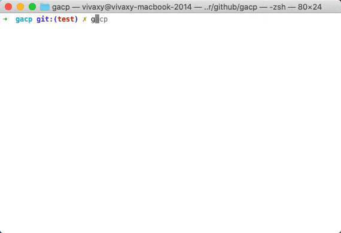

# gacp

[![Build Status][travis-image]][travis-url]
[![NPM Version][npm-version-image]][npm-url]
[![NPM Downloads][npm-downloads-image]][npm-url]
[![MIT License][license-image]][license-url]
[![Standard Version][standard-version-image]][standard-version-url]
[![Codecov][codecov-image]][codecov-url]
[](https://opencollective.com/gacp)

💬Git add, commit, push with [Conventional Commits](https://www.conventionalcommits.org/) and [Gitmoji](https://gitmoji.carloscuesta.me/).



## Installation

`npm i -g gacp`

## Usage

`gacp`

`gacp --help`

`gacp --no-add`

`gacp --no-push`

`gacp --emoji emoji`

`gacp --editor`

`gacp --no-verify`

`gacp --emoji none`

## Configuration File

You can configure gacp via:

- A `gacp` property in `package.json`.
- A `.gacprc` file in JSON, YAML or CommonJS with or without extensions `.json`, `.yaml`, `.yml`, `.js`.
- A `gacp.config.js` file in CommonJS.

### Basic Configuration

Default configuration:

```json
{
  "add": true,
  "push": true,
  "emoji": "code",
  "editor": false,
  "hooks": {
    "postpush": ""
  }
}
```

## Change log

[Change log](CHANGELOG.md)

## Contributing

[Contributing](CONTRIBUTING.md)

## Contributors

### Code Contributors

This project exists thanks to all the people who contribute. [[Contribute](CONTRIBUTING.md)].
<a href="https://github.com/vivaxy/gacp/graphs/contributors"></a>

### Financial Contributors

Become a financial contributor and help us sustain our community. [[Contribute](https://opencollective.com/gacp/contribute)]

#### Individuals

<a href="https://opencollective.com/gacp"></a>

#### Organizations

Support this project with your organization. Your logo will show up here with a link to your website. [[Contribute](https://opencollective.com/gacp/contribute)]

<a href="https://opencollective.com/gacp"></a>

## Related Projects

- [VSCode Conventional Commits](https://github.com/vivaxy/vscode-conventional-commits)
- [gcmt](https://github.com/vivaxy/gcmt)
- [commitizen](https://github.com/commitizen/cz-cli)
- [conventional-changelog](https://github.com/conventional-changelog/conventional-changelog)
- [gitmoji-cli](https://github.com/carloscuesta/gitmoji-cli)
- [git-commit-cp](https://github.com/Dolov/git-commit-cp)
- [git-cz](https://github.com/streamich/git-cz)
- [cz-emoji](https://github.com/ngryman/cz-emoji)

#

[travis-image]: https://img.shields.io/travis/vivaxy/gacp.svg?style=flat-square
[travis-url]: https://travis-ci.org/vivaxy/gacp
[npm-version-image]: http://img.shields.io/npm/v/gacp.svg?style=flat-square
[npm-url]: https://www.npmjs.com/package/gacp
[npm-downloads-image]: https://img.shields.io/npm/dt/gacp.svg?style=flat-square
[license-image]: https://img.shields.io/npm/l/gacp.svg?style=flat-square
[license-url]: LICENSE
[standard-version-image]: https://img.shields.io/badge/release-standard%20version-brightgreen.svg?style=flat-square
[standard-version-url]: https://github.com/conventional-changelog/standard-version
[codecov-image]: https://img.shields.io/codecov/c/github/vivaxy/gacp.svg?style=flat-square
[codecov-url]: https://codecov.io/gh/vivaxy/gacp
